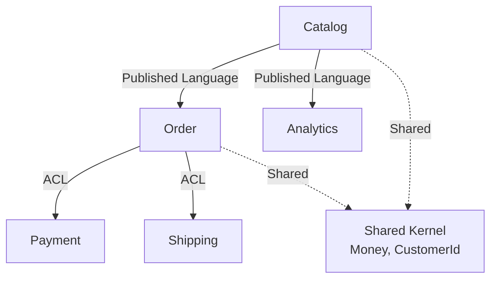
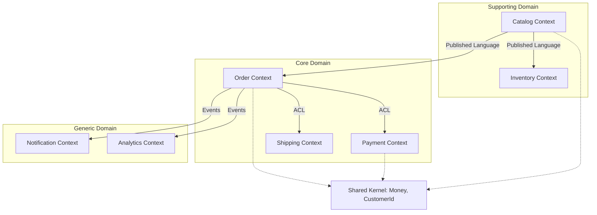
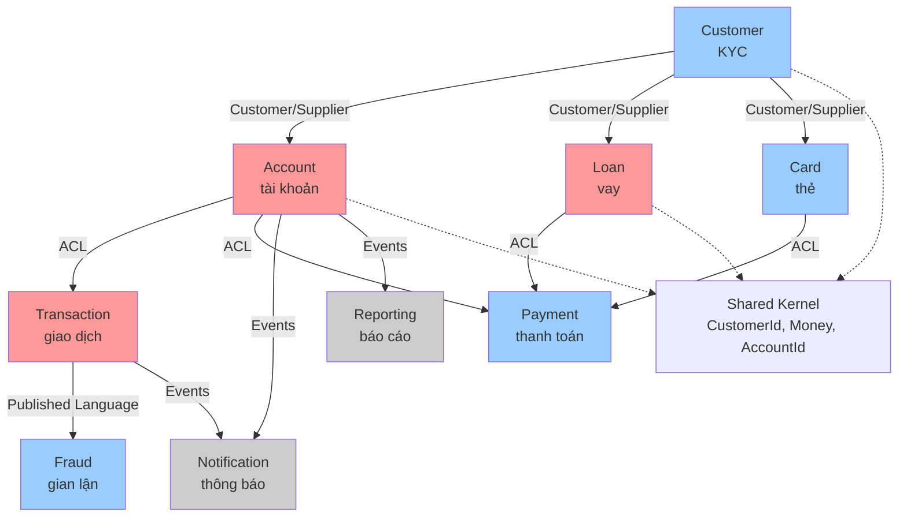

# 📖 Bài 14: Context Mapping — Bản đồ các Bounded Context

> Chúc mừng bạn đã đến **Level 4 — Strategic DDD**. Ba bài tiếp theo sẽ chuyển từ **tactical** (code: Entity, VO, Aggregate...) sang **strategic** (tổ chức hệ thống lớn: Bounded Context, Context Map, Event Storming). Bài này dạy bạn **Context Mapping** — cách vẽ **bản đồ quan hệ** giữa các Bounded Context, và cách chọn **pattern tích hợp** phù hợp.

---

## 🎯 Mục tiêu bài học

Sau bài này, bạn sẽ:

1. Hiểu **Context Map** là gì và tại sao cần.
2. Nắm **7 pattern tích hợp** giữa các context.
3. Biết khi nào dùng **Shared Kernel**, khi nào dùng **ACL**.
4. Hiểu **Upstream/Downstream** và **team politics**.
5. Vẽ được **Context Map** cho hệ thống thực tế.
6. Áp dụng vào **Python**: cấu trúc multi-context project.
7. Tránh được **8 anti-pattern** khi tích hợp.
8. Làm bài tập thực hành có chấm điểm.

---

## 1. Context Map là gì?

### 1.1. Định nghĩa

> **Context Map** là một **bản đồ** mô tả tất cả **Bounded Context** trong hệ thống và **mối quan hệ** giữa chúng. Nó trả lời: "Context nào phụ thuộc context nào? Bằng pattern gì? Ai upstream, ai downstream?"

### 1.2. Trực giác

Hãy nghĩ về **bản đồ các quốc gia**:

- Mỗi quốc gia = 1 Bounded Context.
- Biên giới = ranh giới context.
- Hiệp định thương mại = pattern tích hợp.
- Ai xuất khẩu cho ai = Upstream/Downstream.

Context Map chính là bản đồ đó.

### 1.3. Tại sao cần Context Map?

**1. Nhìn thấy toàn cảnh.** Không có map → không ai biết hệ thống có bao nhiêu context, cái nào phụ thuộc cái nào.

**2. Phát hiện coupling.** Nhìn map thấy ngay chỗ nào coupling chặt, chỗ nào cần ACL.

**3. Thương lượng với team.** Map rõ → biết team nào sở hữu context nào, ai phải coordinate với ai.

**4. Lập kế hoạch refactor.** Muốn tách context → nhìn map biết ảnh hưởng gì.

**5. Onboarding.** Dev mới nhìn map → hiểu hệ thống trong 1 giờ thay vì 1 tuần.

### 1.4. Ai vẽ?

**Không phải dev đơn lẻ.** Context Map được vẽ bởi:

- Tech lead.
- Architect.
- Product owner.
- **Cả team** — trong buổi Event Storming.

**Lý do:** Context Map là **thỏa thuận** giữa các team, không phải quyết định đơn phương.

---

## 2. Upstream / Downstream

Đây là **khái niệm cơ bản** để hiểu mọi pattern tích hợp.

### 2.1. Định nghĩa

> **Upstream** = context **cung cấp** dữ liệu/dịch vụ.
>
> **Downstream** = context **tiêu thụ** dữ liệu/dịch vụ từ upstream.

```
┌──────────────┐              ┌──────────────┐
│  Upstream    │  ──data──▶   │  Downstream  │
│  (Catalog)   │              │   (Order)    │
└──────────────┘              └──────────────┘
```

### 2.2. Ai "mạnh" hơn?

**Upstream có quyền:**

- Thay đổi model của mình.
- Không quan tâm downstream có theo kịp không.

**Downstream có quyền:**

- Yêu cầu upstream thay đổi (nhưng upstream có thể từ chối).
- Tự bảo vệ bằng ACL.

**Team politics:** Upstream thường **mạnh hơn** vì họ kiểm soát nguồn dữ liệu. Downstream phải **thích nghi**.

### 2.3. Ví dụ

| Upstream | Downstream | Dữ liệu |
|---|---|---|
| Catalog | Order | Product info, price |
| Order | Shipping | Order details, address |
| Order | Billing | Order total, customer |
| Payment | Order | Payment status |
| Customer | Order | Customer info |

### 2.4. Quy tắc ngón tay

> **Upstream nên ổn định.** Nếu upstream thay đổi thường xuyên → downstream khổ. Đây là lý do cần **Published Language** hoặc **ACL**.

---

## 3. Bảy pattern tích hợp

Đây là **7 pattern** bạn sẽ dùng để vẽ Context Map. Mỗi pattern có **ưu, nhược, khi nào dùng**.

### 3.1. Shared Kernel

**Ý tưởng:** 2 context **chia sẻ** một phần model chung.

```
┌─────────────┐              ┌─────────────┐
│  Context A  │              │  Context B  │
│             │              │             │
│      ┌──────┴──────────────┴──────┐      │
│      │   Shared Kernel            │      │
│      │   - Money                  │      │
│      │   - CustomerId             │      │
│      │   - DateRange              │      │
│      └────────────┬───────────────┘      │
│                   │                      │
└───────────────────┴──────────────────────┘
```

**Ví dụ:**

```python
# shared/domain/money.py
from dataclasses import dataclass
from decimal import Decimal


@dataclass(frozen=True)
class Money:
    """Shared Kernel — dùng chung giữa nhiều context."""
    amount: Decimal
    currency: str = "VND"

    def __add__(self, other: "Money") -> "Money":
        if self.currency != other.currency:
            raise ValueError("Khác loại tiền tệ")
        return Money(self.amount + other.amount, self.currency)
```

**Khi nào dùng:**

- Khái niệm **thực sự không đổi** (Money, UUID, DateRange).
- Team nhỏ, có thể coordinate dễ.
- Không có team nào dominate.

**Nguy hiểm:**

- Thay đổi → ảnh hưởng **mọi context**.
- Cần coordinate **mọi thay đổi**.
- Coupling chặt.

**Quy tắc:** **Giữ Shared Kernel cực nhỏ.** Chỉ những gì thực sự shared.

### 3.2. Customer/Supplier

**Ý tưởng:** Upstream (Supplier) **quan tâm** đến nhu cầu của Downstream (Customer).

```
┌──────────────┐   negotiate   ┌──────────────┐
│  Supplier    │ ◀───────────  │  Customer    │
│  (Catalog)   │  ──data──▶    │   (Order)    │
└──────────────┘               └──────────────┘
```

**Đặc điểm:**

- Downstream **có tiếng nói** với Upstream.
- Upstream **điều chỉnh** để phục vụ Downstream.
- Có **thỏa thuận** giữa 2 team.

**Ví dụ:**

- Team Catalog và Team Order họp hàng tuần.
- Order nói: "Chúng tôi cần price có timestamp."
- Catalog đồng ý thêm field `price_updated_at` trong API.

**Khi nào dùng:**

- Upstream và Downstream **cùng công ty**.
- Có **kênh giao tiếp** rõ.
- Downstream đủ mạnh để thương lượng.

**Ưu điểm:** Cả 2 bên có lợi.
**Nhược điểm:** Cần coordination.

### 3.3. Conformist

**Ý tưởng:** Downstream **chấp nhận** model của Upstream **nguyên xi**.

```
┌──────────────┐               ┌──────────────┐
│  Upstream    │  ──model──▶   │  Downstream  │
│  (Catalog)   │               │  (Analytics) │
└──────────────┘               └──────────────┘
                                       │
                                       │
                              "Dùng model của họ"
```

**Đặc điểm:**

- Downstream **không có tiếng nói**.
- Chấp nhận model của Upstream.
- Nếu Upstream đổi → Downstream đổi theo.

**Ví dụ:**

- Team Analytics dùng model của Catalog vì không đủ nguồn lực thương lượng.
- Team nhỏ dùng API bên thứ 3 (Stripe, Google Maps) — chấp nhận model của họ.

**Khi nào dùng:**

- Upstream mạnh hơn, không quan tâm Downstream.
- Downstream đủ nhỏ, model của Upstream chấp nhận được.
- **Tạm thời** — khi chưa có nguồn lực.

**Ưu điểm:** Đơn giản, không cần code dịch.
**Nhược điểm:** Downstream mất tự chủ. Upstream đổi → Downstream đổi theo.

### 3.4. Anti-Corruption Layer (ACL) ⭐

**Ý tưởng:** Downstream **tự bảo vệ** bằng cách **dịch** model của Upstream thành model của mình.

```
┌──────────────┐               ┌───────────────────────┐
│  Upstream    │  ──data──▶    │  ACL ──▶  Downstream  │
│  (Catalog)   │               │  (dịch)   (Order)     │
└──────────────┘               └───────────────────────┘
```

**Đặc điểm:**

- Downstream **có lớp dịch** riêng.
- Model của Downstream **không bị ảnh hưởng** khi Upstream đổi.
- Upstream đổi schema → chỉ sửa ACL.

**Ví dụ:**

```python
# order/infrastructure/acl/catalog_acl.py
class CatalogACL:
    """Anti-Corruption Layer — bảo vệ Order khỏi model của Catalog."""

    def __init__(self, client: CatalogClient) -> None:
        self._client = client

    def fetch_product_snapshot(self, sku: str) -> ProductSnapshot:
        # Lấy dữ liệu thô từ Catalog
        raw = self._client.get_product(sku)

        # Dịch sang model của Order
        return ProductSnapshot(
            sku=raw["product_code"],              # Catalog dùng "product_code"
            name=raw["display_name"],              # Catalog dùng "display_name"
            unit_price=Money(
                amount=Decimal(raw["price"]["value"]),
                currency=raw["price"]["currency_code"],
            ),
        )
```

**Khi nào dùng:**

- Downstream muốn **tự chủ**.
- Upstream hay thay đổi.
- Model của Upstream **khác nhiều** model của Downstream.
- **Đây là pattern quan trọng nhất** của Context Mapping.

**Ưu điểm:**

- Downstream độc lập.
- Đổi Upstream → chỉ sửa ACL.
- Model của Downstream sạch.

**Nhược điểm:**

- Thêm code (lớp dịch).
- Cần maintain ACL.

### 3.5. Published Language

**Ý tưởng:** Định nghĩa **ngôn ngữ chuẩn** để trao đổi giữa nhiều context.

```
┌──────────────┐     ┌──────────────────┐     ┌──────────────┐
│  Context A   │ ──▶ │ Published Lang   │ ──▶ │  Context B   │
└──────────────┘     │ (JSON, Protobuf) │     └──────────────┘
                     └──────────────────┘
                            │
                            ▼
                     ┌──────────────┐
                     │  Context C   │
                     └──────────────┘
```

**Ví dụ:** Dùng Protobuf cho integration events.

```protobuf
message OrderPlaced {
  string order_id = 1;
  string customer_id = 2;
  string total_amount = 3;
  string currency = 4;
  int64 occurred_at = 5;
}
```

**Khi nào dùng:**

- Nhiều consumer (3+).
- Cần schema **ổn định**.
- Hệ thống microservices.
- Cần **versioning** rõ ràng.

**Ưu điểm:** Chuẩn, ổn định, versioned.
**Nhược điểm:** Cần tooling (Protobuf, Avro).

### 3.6. Open Host Service

**Ý tưởng:** Context cung cấp **API công khai** cho nhiều consumer.

```
                    ┌──────────────┐
                    │  Context A   │
                    │  OHS API     │
                    └──────┬───────┘
                           │
        ┌──────────────────┼──────────────────┐
        │                  │                  │
        ▼                  ▼                  ▼
   ┌─────────┐       ┌─────────┐       ┌─────────┐
   │ Context B│       │Context C│       │Context D│
   └─────────┘       └─────────┘       └─────────┘
```

**Đặc điểm:**

- 1 context expose **API chuẩn**.
- Nhiều consumer dùng.
- Thường đi kèm **Published Language**.

**Ví dụ:** Stripe API — 1 API, nhiều consumer.

**Khi nào dùng:**

- Có **nhiều consumer**.
- Consumer không cần customize.
- Muốn **giảm coupling**.

### 3.7. Separate Ways

**Ý tưởng:** **Không tích hợp**. Mỗi context tự lo.

```
┌──────────────┐               ┌──────────────┐
│  Context A   │               │  Context B   │
│             │   (không)     │             │
│             │               │             │
└──────────────┘               └──────────────┘
```

**Khi nào dùng:**

- Integration **không đáng** (cost > benefit).
- 2 context **thực sự độc lập**.
- Duplicate data chấp nhận được.

**Ví dụ:**

- Team Analytics có thể tự có data warehouse riêng, không cần integrate với mọi context.

### 3.8. Bảng tổng hợp

| Pattern | Quan hệ | Khi nào dùng | Coupling |
|---|---|---|---|
| **Shared Kernel** | Bình đẳng | Ít, khái niệm không đổi | Rất chặt |
| **Customer/Supplier** | Up-Down, có thương lượng | Cùng công ty, có kênh | Vừa |
| **Conformist** | Up mạnh, Down yếu | Down chấp nhận model | Chặt |
| **ACL** | Up-Down, Down tự bảo vệ | Up hay đổi, Down muốn độc lập | Lỏng |
| **Published Language** | Nhiều consumer | Cần schema chuẩn | Vừa |
| **Open Host Service** | 1-N | Nhiều consumer | Vừa |
| **Separate Ways** | Không có | Không cần tích hợp | Không |

### 3.9. Quy tắc chọn pattern

```
Downstream có tiếng nói với Upstream?
├── Có → Customer/Supplier
└── Không
    ├── Downstream chấp nhận model Upstream?
    │   ├── Có → Conformist
    │   └── Không → ACL
    └── ...

Cần schema chuẩn cho nhiều consumer?
└── Có → Published Language + Open Host Service

Không cần tích hợp?
└── Separate Ways

Có khái niệm thực sự shared?
└── Shared Kernel (nhưng rất ít)
```

---

## 4. Context Map — Ví dụ thực tế

### 4.1. Hệ thống E-commerce

```
                    ┌─────────────┐
                    │   Catalog   │  (Upstream chính)
                    │  (sản phẩm) │
                    └──────┬──────┘
                           │
                    Published Language
                           │
        ┌──────────────────┼──────────────────┬─────────────┐
        │                  │                  │             │
        ▼                  ▼                  ▼             ▼
┌─────────────┐    ┌────────────┐    ┌────────────┐    ┌──────────┐
│   Order     │    │ Inventory  │    │  Pricing   │    │Analytics │
│ (đơn hàng)  │    │  (kho)     │    │  (giá)     │    │          │
└──────┬──────┘    └────────────┘    └────────────┘    └──────────┘
       │
       │ ACL
       │
       ▼
┌─────────────┐    ┌────────────┐
│  Payment    │    │  Shipping  │
│(thanh toán) │    │ (giao hàng)│
└─────────────┘    └────────────┘

Shared Kernel: CustomerId, Money
```

**Phân tích:**

| Cặp | Pattern | Lý do |
|---|---|---|
| Catalog → Order | Published Language | Nhiều consumer |
| Catalog → Inventory | Published Language | Nhiều consumer |
| Catalog → Pricing | Published Language | Nhiều consumer |
| Catalog → Analytics | Conformist | Analytics không thương lượng |
| Order → Payment | ACL | Payment cần model riêng |
| Order → Shipping | ACL | Shipping cần model riêng |
| CustomerId, Money | Shared Kernel | Khái niệm không đổi |

### 4.2. Hệ thống Ngân hàng

```
                    ┌──────────────┐
                    │   Customer   │  (KYC)
                    │              │
                    └──────┬───────┘
                           │
                    Customer/Supplier
                           │
        ┌──────────────────┼──────────────────┬─────────────┐
        │                  │                  │             │
        ▼                  ▼                  ▼             ▼
┌─────────────┐    ┌────────────┐    ┌────────────┐    ┌──────────┐
│  Account    │    │   Loan     │    │    Card    │    │Transaction│
│             │    │            │    │            │    │          │
└──────┬──────┘    └────────────┘    └────────────┘    └──────────┘
       │
       │ ACL
       │
       ▼
┌─────────────┐
│  Reporting  │
│             │
└─────────────┘

Shared Kernel: CustomerId, Money, AccountId
```

### 4.3. Hệ thống Y tế

```
        ┌─────────────┐
        │   Patient   │  (hồ sơ bệnh nhân)
        │             │
        └──────┬──────┘
               │
        Customer/Supplier
               │
    ┌──────────┼──────────┬─────────────┐
    │          │          │             │
    ▼          ▼          ▼             ▼
┌────────┐ ┌────────┐ ┌────────┐ ┌─────────────┐
│Clinic  │ │  Lab   │ │Pharmacy│ │  Billing    │
│(khám)  │ │(xét    │ │(dược)  │ │(thanh toán) │
│        │ │nghiệm) │ │        │ │             │
└────────┘ └────────┘ └────────┘ └─────────────┘
    │          │          │             │
    └──────────┴──────────┴─────────────┘
               │
               ▼
        ┌─────────────┐
        │  Insurance  │
        │  (bảo hiểm) │
        └─────────────┘
```

### 4.4. Hệ thống Đặt vé

```
     ┌─────────────┐
     │   Movies    │
     │  (phim)     │
     └──────┬──────┘
            │
     Published Language
            │
    ┌───────┼───────┬─────────────┐
    │       │       │             │
    ▼       ▼       ▼             ▼
┌────────┐ ┌────────┐ ┌────────┐ ┌─────────────┐
│Cinemas │ │Showtimes│ │Bookings│ │ Notifications│
│(rạp)   │ │(suất   │ │(đặt vé)│ │(thông báo)  │
│        │ │chiếu)  │ │        │ │             │
└────────┘ └────────┘ └────┬───┘ └─────────────┘
                           │
                           │ ACL
                           ▼
                      ┌──────────┐
                      │ Payments │
                      │(thanh    │
                      │ toán)    │
                      └──────────┘
```

---

## 5. Áp dụng vào Python: Multi-context project

### 5.1. Cấu trúc thư mục

```
shop/
├── src/
│   └── shop/
│       ├── shared/                       # ← Shared Kernel
│       │   ├── domain/
│       │   │   ├── money.py
│       │   │   └── ids.py
│       │   └── integration/              # ← Published Language
│       │       └── events/
│       │           └── product_events.py
│       │
│       ├── catalog/                      # ← Context 1
│       │   ├── domain/
│       │   ├── application/
│       │   ├── infrastructure/
│       │   │   └── api/                  # ← Open Host Service
│       │   └── presentation/
│       │
│       ├── order/                        # ← Context 2
│       │   ├── domain/
│       │   ├── application/
│       │   ├── infrastructure/
│       │   │   ├── acl/                  # ← ACL cho Catalog
│       │   │   │   └── catalog_acl.py
│       │   │   └── persistence/
│       │   └── presentation/
│       │
│       └── payment/                      # ← Context 3
│           ├── domain/
│           ├── application/
│           ├── infrastructure/
│           └── presentation/
```

### 5.2. Quy tắc import

**Trong cùng context:** tự do.

**Giữa các context:**

```python
# ✅ ĐÚNG: Order dùng ACL để gọi Catalog
from shop.order.infrastructure.acl.catalog_acl import CatalogACL

# ✅ ĐÚNG: Order dùng Shared Kernel
from shop.shared.domain.money import Money

# ✅ ĐÚNG: Order dùng Published Language
from shop.shared.integration.events.product_events import ProductPriceChanged

# ❌ SAI: Import trực tiếp domain của Catalog
from shop.catalog.domain.model.product import Product   # PHÁ VỠ!
```

### 5.3. Enforce bằng import-linter

```toml
# pyproject.toml
[tool.importlinter]
root_packages = ["shop"]

# Không context nào import domain của context khác
[[tool.importlinter.contracts]]
name = "Catalog domain không bị import bởi context khác"
type = "forbidden"
source_modules = ["shop.order", "shop.payment"]
forbidden_modules = ["shop.catalog.domain"]

[[tool.importlinter.contracts]]
name = "Order domain không bị import bởi context khác"
type = "forbidden"
source_modules = ["shop.catalog", "shop.payment"]
forbidden_modules = ["shop.order.domain"]

[[tool.importlinter.contracts]]
name = "Payment domain không bị import bởi context khác"
type = "forbidden"
source_modules = ["shop.catalog", "shop.order"]
forbidden_modules = ["shop.payment.domain"]

# Shared Kernel không import context nào
[[tool.importlinter.contracts]]
name = "Shared Kernel độc lập"
type = "forbidden"
source_modules = ["shop.shared"]
forbidden_modules = ["shop.catalog", "shop.order", "shop.payment"]
```

### 5.4. ACL đầy đủ

```python
# order/infrastructure/acl/catalog_acl.py
from decimal import Decimal

from shop.order.domain.model.product_snapshot import ProductSnapshot
from shop.shared.domain.money import Money


class CatalogACL:
    """
    Anti-Corruption Layer — bảo vệ Order khỏi Catalog.

    Trách nhiệm:
    - Gọi Catalog API.
    - Dịch response thô sang model của Order.
    - Nếu Catalog đổi schema → chỉ sửa file này.
    """

    def __init__(self, http_client) -> None:
        self._client = http_client

    def fetch_product_snapshot(self, sku: str) -> ProductSnapshot:
        raw = self._client.get(f"http://catalog-api/products/{sku}")
        return self._to_snapshot(raw)

    def fetch_products_bulk(self, skus: list[str]) -> dict[str, ProductSnapshot]:
        raw_list = self._client.post(
            "http://catalog-api/products/bulk",
            json={"skus": skus},
        )
        return {
            item["product_code"]: self._to_snapshot(item)
            for item in raw_list
        }

    def _to_snapshot(self, raw: dict) -> ProductSnapshot:
        return ProductSnapshot(
            sku=raw["product_code"],
            name=raw["display_name"],
            unit_price=Money(
                amount=Decimal(raw["price"]["amount"]),
                currency=raw["price"]["currency"],
            ),
        )
```

### 5.5. Published Language

```python
# shared/integration/events/product_events.py
from dataclasses import dataclass
from datetime import datetime
from decimal import Decimal


@dataclass(frozen=True)
class ProductPriceChanged:
    """
    Published Language — format chuẩn giữa các context.
    """
    event_id: str
    sku: str
    old_price: Decimal
    new_price: Decimal
    currency: str
    occurred_at: datetime


@dataclass(frozen=True)
class ProductDiscontinued:
    event_id: str
    sku: str
    reason: str
    occurred_at: datetime
```

### 5.6. Application Handler dùng ACL

```python
# order/application/commands/place_order.py
class PlaceOrderHandler:
    def __init__(
        self,
        uow: UnitOfWork,
        catalog_acl: CatalogACL,   # ← ACL, không phải Catalog
    ) -> None:
        self._uow = uow
        self._catalog_acl = catalog_acl

    def handle(self, cmd: PlaceOrderCommand) -> UUID:
        with self._uow:
            customer = self._uow.customers.find_by_id(cmd.customer_id)
            if not customer:
                raise CustomerNotFound(cmd.customer_id)

            order = Order.create(cmd.customer_id)
            for item in cmd.items:
                # Dùng ACL — không import gì từ catalog.domain
                snapshot = self._catalog_acl.fetch_product_snapshot(item.sku)
                order.add_line(
                    OrderLine.create(
                        product_snapshot=snapshot,
                        quantity=item.quantity,
                    )
                )
            order.place()

            self._uow.orders.save(order)
            self._uow.commit()
        return order.id
```

**Điểm mấu chốt:** `PlaceOrderHandler` **không biết** Catalog có class `Product` nào. Nó chỉ biết `ProductSnapshot` của chính nó.

---

## 6. Vẽ Context Map — Quy trình

### 6.1. Các bước

**Bước 1: Liệt kê tất cả context.**

Hỏi: "Hệ thống có bao nhiêu vùng ngôn ngữ/nghiệp vụ khác nhau?"

**Bước 2: Xác định team ownership.**

Mỗi context thuộc team nào? Team size bao nhiêu?

**Bước 3: Xác định quan hệ.**

Với mỗi cặp context:
- Ai upstream, ai downstream?
- Có trao đổi dữ liệu không?
- Pattern gì?

**Bước 4: Vẽ sơ đồ.**

Dùng ASCII, Mermaid, hoặc công cụ vẽ.

**Bước 5: Đánh dấu hotspots.**

Chỗ nào còn mơ hồ? Chỗ nào coupling chặt?

**Bước 6: Review với team.**

Context Map là **thỏa thuận**, không phải quyết định đơn phương.

### 6.2. Công cụ vẽ

**Mermaid (khuyến nghị):**



**ASCII đơn giản:**

```
        [Catalog]
           │
    Published Language
           │
    ┌──────┼──────┐
    ▼      ▼      ▼
 [Order] [Analytics] [Pricing]
    │
    │ ACL
    ▼
 [Payment]   [Shipping]
```

### 6.3. Ví dụ Mermaid cho E-commerce



---

## 7. Tám anti-pattern khi tích hợp Context

### ❌ Anti-pattern 1: Shared Database

```python
# ❌ SAI: Order và Catalog dùng chung DB
# Order đọc thẳng bảng products của Catalog
session.execute("SELECT * FROM products WHERE sku = ?")   # Trong Order context!
```

**Vấn đề:**

- Coupling chặt qua DB.
- Catalog đổi schema → Order fail.
- Không thể tách DB.

**Fix:** Order gọi API hoặc ACL.

### ❌ Anti-pattern 2: Import trực tiếp domain của context khác

```python
# ❌ SAI
from shop.catalog.domain.model.product import Product   # Trong order/

class Order:
    def add_product(self, product: Product) -> None:   # Phụ thuộc Catalog!
        ...
```

**Fix:** Dùng ACL + ProductSnapshot.

### ❌ Anti-pattern 3: Shared Kernel quá lớn

```python
# ❌ SAI: Shared Kernel chứa mọi thứ
shared/
├── domain/
│   ├── money.py
│   ├── customer.py        # ← Entity của Customer
│   ├── order.py           # ← Entity của Order
│   ├── product.py         # ← Entity của Product
│   ├── payment.py
│   └── ... (50 files)
```

**Fix:** Shared Kernel chỉ chứa **khái niệm không đổi**: `Money`, `UUID`, `DateRange`. Không chứa Entity.

### ❌ Anti-pattern 4: Conformist vĩnh viễn

```python
# ❌ SAI: Downstream không bao giờ tự chủ
class Order:
    def use_catalog_model(self):
        # Dùng thẳng model của Catalog mãi mãi
        pass
```

**Fix:** Khi có nguồn lực → chuyển sang ACL.

### ❌ Anti-pattern 5: Không có ACL khi cần

```python
# ❌ SAI: Order gọi thẳng Catalog API và dùng raw response
def place_order(self, sku: str):
    raw = httpx.get(f"http://catalog/products/{sku}").json()
    # Dùng raw["product_code"], raw["price"]["value"] khắp nơi!
```

**Fix:** Wrap trong ACL.

### ❌ Anti-pattern 6: Context Map không ai biết

```python
# ❌ SAI: Context Map chỉ có trong đầu architect
# Không có tài liệu, không có sơ đồ
```

**Fix:** Viết Context Map ra file `docs/context-map.md`, update khi thay đổi.

### ❌ Anti-pattern 7: Circular dependency giữa context

```
┌──────────────┐                ┌──────────────┐
│  Catalog     │ ─────────────▶ │   Order      │
│              │ ◀───────────── │              │
└──────────────┘                └──────────────┘
```

**Vấn đề:**

- Không thể build độc lập.
- Không thể deploy độc lập.
- Khó test.

**Fix:**

- Tách khái niệm shared ra context thứ 3.
- Dùng event (async) thay vì gọi trực tiếp.

### ❌ Anti-pattern 8: Không versioned Published Language

```python
# ❌ SAI: Không có version
@dataclass
class ProductPriceChanged:
    sku: str
    new_price: Decimal
    # Không có version!
```

**Fix:**

```python
# ✅ ĐÚNG: Có version
@dataclass(frozen=True)
class ProductPriceChangedV1:
    version: str = "1.0"
    event_id: str = ""
    sku: str = ""
    new_price: Decimal = Decimal("0")
    currency: str = "VND"
    occurred_at: datetime = None   # type: ignore

@dataclass(frozen=True)
class ProductPriceChangedV2:
    version: str = "2.0"
    event_id: str = ""
    sku: str = ""
    new_price: Decimal = Decimal("0")
    currency: str = "VND"
    old_price: Decimal = Decimal("0")   # ← Thêm field mới
    occurred_at: datetime = None   # type: ignore
```

---

## 8. Ví dụ tổng hợp: Bank System Context Map

Cho hệ thống ngân hàng:

### 8.1. Contexts

1. **Customer** — KYC, thông tin khách hàng.
2. **Account** — tài khoản, số dư.
3. **Transaction** — giao dịch.
4. **Loan** — vay vốn.
5. **Card** — thẻ tín dụng, thẻ ghi nợ.
6. **Payment** — thanh toán hóa đơn.
7. **Notification** — thông báo.
8. **Reporting** — báo cáo.
9. **Fraud** — phát hiện gian lận.

### 8.2. Context Map



### 8.3. Phân loại Core/Supporting/Generic

| Loại | Context | Lý do |
|---|---|---|
| **Core Domain** | Account, Transaction, Loan | Nghiệp vụ chính của ngân hàng |
| **Supporting** | Customer, Payment, Card, Fraud | Hỗ trợ core |
| **Generic** | Notification, Reporting | Có thể mua/outsource |

**Insight:** **Core Domain** cần đầu tư nhiều nhất (team giỏi, DDD kỹ). **Generic** có thể dùng giải pháp có sẵn (SendGrid cho notification, Grafana cho reporting).

---

## 9. Bài tập về nhà

### 🟢 Bài tập 1 (dễ): Vẽ Context Map cho thư viện

Cho hệ thống thư viện với các context:

- **Catalog** (sách)
- **Member** (thành viên)
- **Loan** (mượn/trả)
- **Reservation** (đặt trước)
- **Notification** (thông báo)
- **Reporting** (báo cáo)

Yêu cầu:

1. Vẽ Context Map (ASCII hoặc Mermaid).
2. Với mỗi cặp context, chỉ định pattern (ACL, Conformist, Shared Kernel...).
3. Xác định Core Domain, Supporting Domain, Generic Domain.

### 🟡 Bài tập 2 (trung bình): Context Map cho E-learning

Cho hệ thống e-learning với các context:

- **Course** (khóa học)
- **Student** (học viên)
- **Enrollment** (đăng ký)
- **Content** (nội dung bài giảng)
- **Quiz** (bài kiểm tra)
- **Certificate** (chứng chỉ)
- **Payment** (thanh toán)
- **Analytics** (phân tích học tập)

Yêu cầu:

1. Vẽ Context Map.
2. Xác định Upstream/Downstream cho mỗi cặp.
3. Chọn pattern tích hợp, giải thích lý do.
4. Xác định Shared Kernel (nếu có).

### 🔴 Bài tập 3 (khó): Refactor monolith thành multi-context

Cho monolith Python đơn giản:

```
shop/
├── models.py     # SQLAlchemy: User, Product, Order, Payment
├── services.py   # UserService, ProductService, OrderService, PaymentService
├── routes.py     # API routes
└── db.py         # Database setup
```

Yêu cầu:

1. Xác định 3-5 Bounded Context.
2. Refactor thành cấu trúc multi-context:
   ```
   shop/
   ├── shared/
   ├── catalog/
   ├── order/
   ├── payment/
   └── customer/
   ```
3. Tách Domain model, Application, Infrastructure, Presentation cho mỗi context.
4. Viết ACL khi Order cần Product từ Catalog.
5. Setup `import-linter` chặn import chéo.
6. Vẽ Context Map.
7. Viết ít nhất 20 test.

Bonus: Chuyển từ ACL (sync) sang Event (async) giữa Catalog và Order.

---

## 10. Checklist sau bài 14

Trước khi sang bài 15, bạn phải tự tin trả lời:

- [ ] Context Map là gì? Tại sao cần?
- [ ] Upstream/Downstream là gì?
- [ ] 7 pattern tích hợp là gì?
- [ ] Shared Kernel — khi nào dùng, khi nào tránh?
- [ ] Customer/Supplier vs Conformist khác nhau thế nào?
- [ ] ACL — tại sao quan trọng nhất?
- [ ] Published Language — khi nào cần?
- [ ] Open Host Service — khi nào dùng?
- [ ] Khi nào Separate Ways?
- [ ] Core/Supporting/Generic Domain — khác nhau thế nào?
- [ ] 8 anti-pattern khi tích hợp Context?

Nếu trả lời được hết, bạn đã sẵn sàng bài 15.

---

## 11. Tóm tắt bài 14

| Điểm | Nội dung |
|---|---|
| **Context Map** | Bản đồ Bounded Context + quan hệ |
| **Upstream** | Cung cấp dữ liệu |
| **Downstream** | Tiêu thụ dữ liệu |
| **Shared Kernel** | Chia sẻ model — cực nhỏ |
| **Customer/Supplier** | Up-Down, có thương lượng |
| **Conformist** | Down chấp nhận model Up |
| **ACL** | Down tự bảo vệ — quan trọng nhất |
| **Published Language** | Ngôn ngữ chuẩn cho nhiều consumer |
| **Open Host Service** | 1-N API |
| **Separate Ways** | Không tích hợp |
| **Core Domain** | Đầu tư nhiều — team giỏi, DDD kỹ |
| **Generic Domain** | Mua/outsource |
| **8 anti-pattern** | Shared DB, import chéo, Shared Kernel lớn, Conformist vĩnh viễn, không ACL, không tài liệu, circular, không versioned |

**Câu thần chú:** *"Context nào cũng có ngôn ngữ riêng. Đừng cố đồng nhất. Hãy dịch (ACL) khi cần."*

---

## 12. Chuẩn bị cho bài 15

Bài tiếp theo: **Event Storming — Khám phá domain cùng business**.

Chuẩn bị:
- Đọc lại bài 8 (Domain Event) và bài 14 (Context Map).
- Nghĩ về **1 domain bạn đang làm** — chuẩn bị cho buổi event storming giả lập.
- Sẽ bàn: Event Storming là gì, quy trình 3 cấp độ (Big Picture, Process, Design), các sticky notes, và cách chạy workshop.

Đây là bài **rất thực tế** — bạn sẽ học cách **khám phá domain** cùng business, thay vì đoán mò.

---

📌 **Bạn muốn tôi làm gì tiếp?**

1. **Chấm bài tập** khi bạn viết xong.
2. **Đi tiếp bài 15** (Event Storming) ngay.
3. **Viết code mẫu đầy đủ** cho một trong ba bài tập.
4. **Đào sâu** một phần: Mermaid, Conway's Law, team topology, Core Domain chart.
5. **Review Context Map** của bạn — nếu bạn gửi sơ đồ, tôi sẽ chỉ ra chỗ chưa hợp lý.

Nói tôi biết bạn muốn gì nhé.