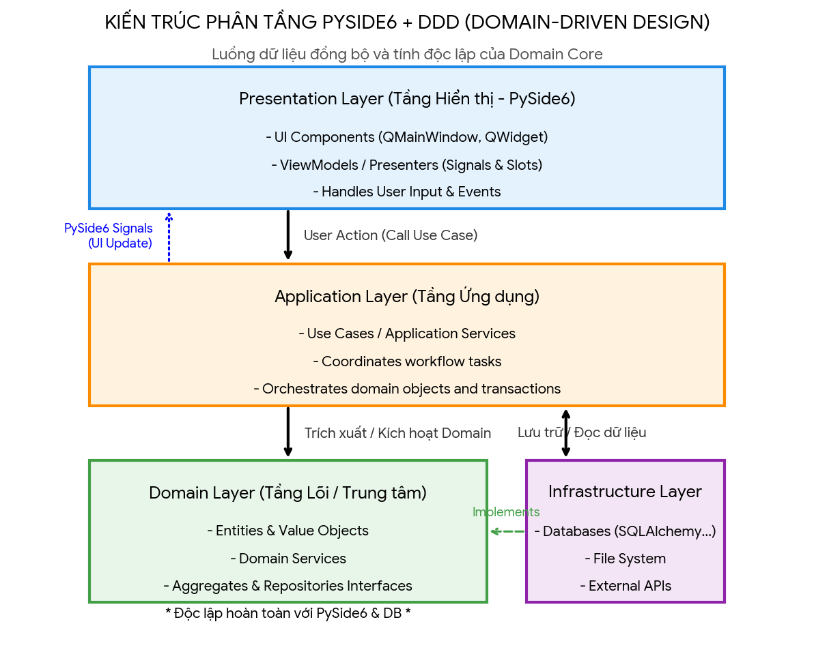

Áp dụng **Domain-Driven Design (DDD)** và các nguyên lý **SOLID** vào lập trình [PySide6](https://www.pythonguis.com/pyside6-tutorial/) (một framework GUI vốn phụ thuộc nặng nề vào các lớp C++ của Qt) giúp tách biệt hoàn toàn giao diện người dùng khỏi logic nghiệp vụ, từ đó giải quyết bài toán mã nguồn bị phình to, rối rắm và khó kiểm thử. [[1](https://www.reddit.com/r/learnpython/comments/1syb4uv/is_pyside6_the_best_framework_to_completely/?tl=vi), [2](https://translate.google.com/translate?u=https://www.pythonguis.com/pyside6-tutorial/&hl=vi&sl=en&tl=vi&client=sge)]

Dưới đây là kiến trúc tổng quan và hướng dẫn triển khai chi tiết từ lý thuyết đến thực hành.

* * *

## Kiến trúc tổng quan (Layered Architecture trong DDD)

Để ứng dụng DDD vào PySide6, mã nguồn được chia thành 4 tầng riêng biệt:

  1. **Presentation Layer (Tầng Giao diện):** Nơi chứa các widget PySide6 (`QMainWindow`, `QWidget`). Tầng này **chỉ** làm nhiệm vụ hiển thị và hứng sự kiện (Click, Hover, Type) của người dùng. [[1](https://ro.scribd.com/document/419721237/L%E1%BA%ADp-trinh-Python-GUI-v%E1%BB%9Bi-PySide)]
  2. **Application Layer (Tầng Ứng dụng):** Đóng vai trò là "điều phối viên". Nó nhận yêu cầu từ UI, gọi đến tầng Domain để thực thi nghiệp vụ và lưu trữ dữ liệu thông qua Repository.
  3. **Domain Layer (Tầng Nghiệp vụ):** Trái tim của ứng dụng. Chứa các [Value Objects](https://www.facebook.com/groups/vietnam.laravel/posts/2547897598933583/), Entities, và Domain Services. Tầng này **không được phép** import bất kỳ module nào của PySide6 hoặc database. [[1](https://www.facebook.com/groups/vietnam.laravel/posts/2547897598933583/)]
  4. **Infrastructure Layer (Tầng Hạ tầng):** Thực thi các chi tiết công nghệ cụ thể như cơ sở dữ liệu (SQLite, PostgreSQL), gọi API, hoặc đọc file.

* * *

## Áp dụng SOLID vào từng tầng trong PySide6

Việc áp dụng [SOLID](https://realpython.com/solid-principles-python/) giúp mối liên kết giữa các tầng trở nên lỏng lẻo (loose coupling) và dễ bảo trì: [[1](https://topdev.vn/blog/solid-la-gi/), [2](https://translate.google.com/translate?u=https://realpython.com/solid-principles-python/&hl=vi&sl=en&tl=vi&client=sge)]

1\. S - Single Responsibility Principle (Nguyên lý đơn nhiệm)

  * **UI không xử lý logic:** Một lớp kế thừa từ `QWidget` chỉ có một lý do duy nhất để thay đổi: thay đổi giao diện. Bạn không được viết code tính toán tiền lương hay truy vấn database ngay trong hàm xử lý sự kiện nút click (`on_button_clicked`). [[1](https://www.youtube.com/watch?v=uMgRqQppbUo), [2](https://ro.scribd.com/document/419721237/L%E1%BA%ADp-trinh-Python-GUI-v%E1%BB%9Bi-PySide), [3](https://topdev.vn/blog/solid-la-gi/)]

2\. O - Open/Closed Principle (Nguyên lý Mở/Đóng)

  * **Mở rộng widget không sửa mã nguồn cũ:** Ví dụ, bạn có một bảng hiển thị dữ liệu (`QTableView`). Thay vì sửa trực tiếp mã nguồn của bảng khi cần hiển thị định dạng dữ liệu mới, hãy kế thừa và mở rộng thông qua các lớp `QIdentityProxyModel` hoặc custom `QStyledItemDelegate`.

3\. L - Liskov Substitution Principle (Nguyên lý thay thế Liskov)

  * **Kế thừa đúng chuẩn Qt:** Khi viết các component tùy biến (Custom Widgets), lớp con phải hoạt động hoàn hảo ở bất kỳ nơi nào lớp cha được yêu cầu. Nếu bạn kế thừa `QLineEdit` để làm ô nhập số, nó không được làm hỏng các hành vi cơ bản của `QLineEdit` gốc như nhận diện sự kiện focus hoặc copy/paste. [[1](https://topdev.vn/blog/solid-la-gi/)]

4\. I - Interface Segregation Principle (Nguyên lý phân tách giao diện)

  * **Sử dụng các class giao tiếp nhỏ gọn:** Python hỗ trợ đa kế thừa và Duck Typing, nhưng khi định nghĩa các Interface bằng `abc.ABC` để các tầng giao tiếp với nhau, hãy giữ chúng nhỏ gọn. Đừng tạo ra một Interface chứa cả hàm lưu dữ liệu, hàm validate lẫn hàm render UI. [[1](https://translate.google.com/translate?u=https://realpython.com/solid-principles-python/&hl=vi&sl=en&tl=vi&client=sge), [2](https://topdev.vn/blog/solid-la-gi/)]

5\. D - Dependency Inversion Principle (Nguyên lý đảo ngược phụ thuộc)

  * **UI phụ thuộc vào trừu tượng (Abstraction):** Tầng Presentation (PySide6) không được khởi tạo trực tiếp các lớp xử lý database. Thay vào đó, nó giao tiếp với Tầng Ứng dụng qua các Interface/Abstract Class. Chúng ta sử dụng cơ chế Dependency Injection (Bơm phụ thuộc) để truyền các thực thi cụ thể vào UI lúc khởi chạy. [[1](https://topdev.vn/blog/solid-la-gi/)]

* * *

## Ví dụ thực tế: Ứng dụng Quản lý Tác vụ (Task Management)

Dưới đây là kịch bản xây dựng một tính năng thêm tác vụ mới ứng dụng triệt để DDD và SOLID. [[1](https://remin.ai/tom-tat/huong-dan-xay-dung-ung-dung-todolist-voi-pyside6-va-python)]

### Bước 1: Domain Layer (Tách biệt hoàn toàn, thuần Python)

Định nghĩa thực thể nghiệp vụ cốt lõi. [[1](https://www.facebook.com/groups/vietnam.laravel/posts/2547897598933583/)]

python
    
    
    # domain/models.py
    from dataclasses import dataclass
    import datetime
    
    @dataclass
    class Task:
        """Domain Entity: Không chứa bất kỳ mã nguồn nào của Qt/PySide6."""
        id: str
        title: str
        is_completed: bool = False
        created_at: datetime.datetime = datetime.datetime.now()
    
        def complete(self):
            self.is_completed = True
    

Hãy thận trọng khi sử dụng mã.

Định nghĩa Interface (Cổng giao tiếp trừu tượng) cho kho lưu trữ dữ liệu: [[1](https://topdev.vn/blog/solid-la-gi/)]

python
    
    
    # domain/interfaces.py
    from abc import ABC, abstractmethod
    from domain.models import Task
    
    class TaskRepository(ABC):
        """Interface tuân thủ Dependency Inversion (D) và Interface Segregation (I)."""
        @abstractmethod
        def save(self, task: Task) -> None:
            pass
    

Hãy thận trọng khi sử dụng mã.

### Bước 2: Infrastructure Layer (Thực thi chi tiết kỹ thuật)

Lớp này chịu trách nhiệm lưu dữ liệu thực tế (Ví dụ: lưu vào file JSON hoặc Database). [[1](https://www.studocu.vn/vn/document/truong-dai-hoc-su-pham-ky-thuat-tphcm/nhap-mon-lap-trinh-python/bao-cao-do-an-cuoi-ky-python-ung-dung-to-do-list-nhom-7/127295523)]

python
    
    
    # infrastructure/repositories.py
    import json
    from domain.interfaces import TaskRepository
    from domain.models import Task
    
    class JsonTaskRepository(TaskRepository):
        """Thực thi cụ thể của Repository, nằm ở tầng hạ tầng."""
        def __init__(self, file_path: str):
            self.file_path = file_path
    
        def save(self, task: Task) -> None:
            # Code đọc/ghi file JSON thực tế tại đây
            print(f"Đã lưu tác vụ '{task.title}' vào file {self.file_path}")
    

Hãy thận trọng khi sử dụng mã.

### Bước 3: Application Layer (Điều phối hành động)

Nơi tiếp nhận yêu cầu từ giao diện, xử lý luồng đi của dữ liệu.

python
    
    
    # application/services.py
    import uuid
    from domain.models import Task
    from domain.interfaces import TaskRepository
    
    class TaskApplicationService:
        """Điều phối nghiệp vụ, không quan tâm UI hiển thị như thế nào."""
        def __init__(self, repository: TaskRepository):
            self._repository = repository
    
        def create_new_task(self, title: str) -> Task:
            if not title.strip():
                raise ValueError("Tiêu đề tác vụ không được để trống.")
                
            task = Task(id=str(uuid.uuid4()), title=title)
            self._repository.save(task)
            return task
    

Hãy thận trọng khi sử dụng mã.

### Bước 4: Presentation Layer (Giao diện người dùng PySide6)

Tầng này chỉ chịu trách nhiệm vẽ giao diện, hứng sự kiện từ người dùng và đẩy dữ liệu vào tầng Application. [[1](https://ro.scribd.com/document/419721237/L%E1%BA%ADp-trinh-Python-GUI-v%E1%BB%9Bi-PySide)]

python
    
    
    # presentation/views.py
    from PySide6.QtWidgets import QMainWindow, QWidget, QVBoxLayout, QLineEdit, QPushButton, QMessageBox
    from application.services import TaskApplicationService
    
    class TaskWindow(QMainWindow):
        """Presentation Layer: Chỉ phụ thuộc vào Application Service trừu tượng (DIP)."""
        def __init__(self, app_service: TaskApplicationService):
            super().__init__()
            self.app_service = app_service
            self.init_ui()
    
        def init_ui(self):
            self.setWindowTitle("Quản lý tác vụ (DDD + SOLID)")
            
            # Tạo Layout và Component
            layout = QVBoxLayout()
            self.input_title = QLineEdit(self)
            self.input_title.setPlaceholderText("Nhập tên tác vụ tại đây...")
            
            self.btn_add = QPushButton("Thêm tác vụ", self)
            # Kết nối sự kiện Click (Signal/Slot của Qt)
            self.btn_add.clicked.connect(self.on_add_clicked)
            
            layout.addWidget(self.input_title)
            layout.addWidget(self.btn_add)
            
            container = QWidget()
            container.setLayout(layout)
            self.setCentralWidget(container)
    
        def on_add_clicked(self):
            """Hàm hứng sự kiện: Không chứa logic nghiệp vụ, chỉ điều phối luồng UI."""
            title = self.input_title.text()
            try:
                # UI gọi xuống tầng ứng dụng để thực thi
                task = self.app_service.create_new_task(title)
                QMessageBox.information(self, "Thành công", f"Đã tạo tác vụ: {task.title}")
                self.input_title.clear()
            except ValueError as e:
                # Xử lý hiển thị lỗi lên UI
                QMessageBox.warning(self, "Lỗi dữ liệu", str(e))
    

Hãy thận trọng khi sử dụng mã.

### Bước 5: Composition Root (Khởi chạy ứng dụng)

Nơi duy nhất kết nối tất cả các thành phần lại với nhau (Dependency Injection).

python
    
    
    # main.py
    import sys
    from PySide6.QtWidgets import QApplication
    from infrastructure.repositories import JsonTaskRepository
    from application.services import TaskApplicationService
    from presentation.views import TaskWindow
    
    if __name__ == "__main__":
        app = QApplication(sys.argv)
    
        # 1. Khởi tạo tầng hạ tầng
        repo = JsonTaskRepository(file_path="tasks.json")
        
        # 2. Bơm hạ tầng vào tầng ứng dụng
        app_service = TaskApplicationService(repository=repo)
        
        # 3. Bơm tầng ứng dụng vào giao diện PySide6
        window = TaskWindow(app_service=app_service)
        window.show()
    
        sys.exit(app.exec())
    

Hãy thận trọng khi sử dụng mã.

* * *

Lợi ích cốt lõi của giải pháp này

  * **Dễ dàng Viết Unit Test:** Bạn có thể viết kiểm thử tự động cho toàn bộ logic của `TaskApplicationService` và `Task` mà không cần phải khởi chạy giao diện `QApplication` của PySide6 (vốn rất chậm và khó thiết lập trong môi trường CI/CD).
  * **Thay thế Công nghệ Linh hoạt:** Nếu ngày mai bạn không muốn lưu bằng file JSON nữa mà chuyển sang dùng SQLite, bạn chỉ cần viết một lớp `SqliteTaskRepository` kế thừa từ `TaskRepository`. Bạn hoàn toàn **không cần chỉnh sửa một dòng code nào** trong file giao diện `TaskWindow`. [[1](https://topdev.vn/blog/solid-la-gi/)]
  * **Giao diện mượt mà hơn:** Bằng cách tách biệt logic nghiệp vụ, bạn dễ dàng đẩy các tác vụ nặng (như tải file, truy vấn DB lớn) xuống các luồng ngầm (`QThread` hoặc `Worker`) thuộc tầng hạ tầng mà không làm đóng băng giao diện người dùng (UI Freezing). [[1](https://www.reddit.com/r/learnpython/comments/1syb4uv/is_pyside6_the_best_framework_to_completely/?tl=vi)]

Bạn đang có ý định áp dụng kiến trúc này cho một **hệ thống sẵn có** hay xây dựng một **dự án mới từ đầu**? Hãy chia sẻ thêm về **quy mô dữ liệu** hoặc **tính năng phức tạp nhất** trong ứng dụng của bạn để tôi có thể tư vấn sâu hơn về cách phân chia [Bounded Context](https://hoangtuan151.medium.com/kien-truc-phan-tang-trong-domain-driven-design-68cba3320553) hoặc quản lý [State/Event](https://ro.scribd.com/document/419721237/L%E1%BA%ADp-trinh-Python-GUI-v%E1%BB%9Bi-PySide) của Qt nhé! [[1](https://www.facebook.com/groups/vietnam.laravel/posts/2547897598933583/), [2](https://ro.scribd.com/document/419721237/L%E1%BA%ADp-trinh-Python-GUI-v%E1%BB%9Bi-PySide)]