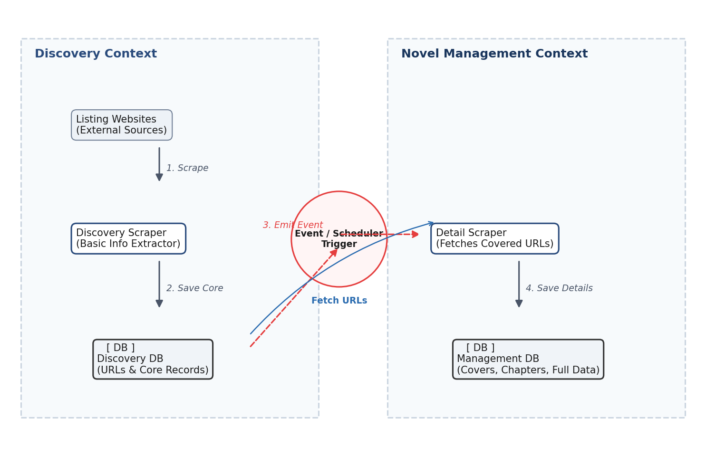

Trong bài toán crawl truyện của bạn, khi áp dụng **Bounded Context (BC)** của Domain-Driven Design (DDD) vào việc thiết kế cơ sở dữ liệu, chúng ta phải giải quyết bài toán: **Cùng một thực thể (Novel) nhưng có dữ liệu khác nhau ở các giai đoạn (Listing vs Detail).**

Nếu thiết kế theo cách truyền thống (Data-driven), bạn sẽ tạo một bảng `novels` chứa tất cả các trường, dẫn đến việc khi crawl trang Listing, các trường như `cover` hay `chapters` sẽ bị `NULL`. Điều này vi phạm nguyên tắc đóng gói của DDD.

Dưới đây là phương án giải quyết bài toán lưu DB theo đúng tư duy Bounded Context.

* * *

1\. Phân chia Bounded Context cho hệ thống Crawl

Quy trình crawl của bạn thực chất được chia làm **2 ngữ cảnh nghiệp vụ (Context)** hoàn toàn khác nhau về hành vi, tần suất chạy và cấu trúc dữ liệu:

  * **Scraping / Discovery Context (Ngữ cảnh Khám phá):** Nhiệm vụ là quét nhanh qua các trang danh sách (Listing) để tìm kiếm các đầu truyện mới, lấy thông tin cơ bản (title, author, url) nhằm mục đích **định danh và lập lịch**.
  * **Novel Management Context (Ngữ cảnh Quản lý Truyện):** Nhiệm vụ là đi sâu vào từng URL cụ thể để cào toàn bộ thông tin chi tiết (cover, danh sách chương) và **phục vụ cho việc đọc truyện**.

---

* * *

2\. Thiết kế Cơ sở Dữ liệu theo Bounded Context

Có 2 cách tiếp cận để lưu DB tùy thuộc vào quy mô dự án của bạn:

Cách 1: Tách biệt bảng dữ liệu (Bảng riêng cho từng Context) - Khuyên dùng cho DDD

Mỗi Context sở hữu một bảng riêng. Dữ liệu có thể hơi trùng lặp nhưng đổi lại các hệ thống hoàn toàn độc lập, rất dễ mở rộng nếu sau này bạn muốn tách thành các service chạy đa luồng riêng biệt.

  1. **Bảng`discovered_novels` (Thuộc Discovery Context):**
     * `url` (Khóa chính - Primary Key): Dùng URL làm ID vì đây là thứ duy nhất để định danh một truyện trên web nguồn khi chưa có ID hệ thống.
     * `title`
     * `author`
     * `status` (Ví dụ: `PENDING`, `CRAWLED`, `FAILED` \- Phục vụ cho việc lập lịch cào chi tiết).
  2. **Bảng`novels` và `chapters` (Thuộc Novel Management Context):**
     * Bảng `novels`: `id` (Auto Increment hoặc UUID), `title`, `author`, `source_url`, `cover_image_url`, `description`.
     * Bảng `chapters`: `id`, `novel_id` (Foreign Key), `chapter_number`, `title`, `content_url`.

Cách 2: Sử dụng một bảng nhưng phân ranh giới bằng Trạng thái (Single Table State Pattern)

Nếu dự án nhỏ và bạn muốn dùng chung một bảng để tiết kiệm tài nguyên, thực thể `Novel` trong DB phải có một trường `state` hoặc `phase`.

  * Khi ở giai đoạn Listing, thực thể được coi là một **`DiscoveredLink` Value Object** (chưa phải là một Aggregate Root hoàn chỉnh).
  * Khi đã cào đủ Detail, nó mới chính thức trở thành **`Novel` Aggregate Root**.

* * *

3\. Triển khai Code (Python) áp dụng Bounded Context và SOLID

Dưới đây là cách bạn tổ chức code để lưu DB cho 2 giai đoạn này mà không làm lẫn lộn logic của chúng.

Giai đoạn 1: Lưu dữ liệu từ trang Listing (Discovery Context)

python
    
    
    # discovery_context/domain/models.py
    from dataclasses import dataclass
    
    @dataclass
    class DiscoveredNovel:
        """Domain Model của tầng quét Listing. Chỉ cần tối giản."""
        url: str
        title: str
        author: str
        status: str = "PENDING"
    

Hãy thận trọng khi sử dụng mã.

python
    
    
    # discovery_context/infrastructure/repositories.py
    class SqliteDiscoveryRepository:
        def save(self, novel: DiscoveredNovel):
            # Thực hiện câu lệnh INSERT OR IGNORE vào bảng `discovered_novels`
            # Nếu trùng URL thì bỏ qua, đảm bảo không cào trùng
            query = """
                INSERT INTO discovered_novels (url, title, author, status) 
                VALUES (?, ?, ?, ?) 
                ON CONFLICT(url) DO NOTHING
            """
            print(f"Đã lưu link thô: {novel.title} -> Chờ xếp hàng cào chi tiết.")
    

Hãy thận trọng khi sử dụng mã.

Giai đoạn 2: Lưu dữ liệu từ trang Detail (Novel Management Context)

Khi Worker của bạn lấy các URL có trạng thái `PENDING` ra để cào chi tiết, dữ liệu thu về sẽ được xử lý bởi một Context hoàn toàn khác.

python
    
    
    # novel_context/domain/models.py
    from dataclasses import dataclass, field
    from typing import List
    
    @dataclass
    class Chapter:
        number: int
        title: str
        url: str
    
    @dataclass
    class Novel:
        """Aggregate Root của Novel Context. Dữ liệu toàn vẹn và có hành vi."""
        id: str
        title: str
        author: str
        source_url: str
        cover_url: str
        chapters: List[Chapter] = field(default_factory=list)
    
        def add_chapter(self, chapter: Chapter):
            # Luật nghiệp vụ: Không cho phép trùng số chương
            if any(c.number == chapter.number for c in self.chapters):
                return
            self.chapters.append(chapter)
    

Hãy thận trọng khi sử dụng mã.

python
    
    
    # novel_context/infrastructure/repositories.py
    class SqliteNovelRepository:
        def save_full_novel(self, novel: Novel):
            # 1. Lưu vào bảng `novels` (Chi tiết truyện)
            # 2. Lưu vào bảng `chapters` (Danh sách chương)
            # 3. Cập nhật lại bảng `discovered_novels` ở context kia thành 'CRAWLED' (Nếu dùng chung DB)
            print(f"Đã lưu trọn bộ truyện '{novel.title}' với {len(novel.chapters)} chương vào DB đọc truyện.")
    

Hãy thận trọng khi sử dụng mã.

* * *

4\. Giao tiếp giữa 2 Context (State/Event)

Làm sao để Giai đoạn 2 biết Giai đoạn 1 đã cào xong Listing để nhảy vào cào Detail? Chúng ta ứng dụng cơ chế **Event** :

  1. **Dạng Đồng bộ (Scheduler):** Một hàm ngầm (Worker) quét bảng `discovered_novels` mỗi 5 phút một lần, lọc ra các truyện có `status = 'PENDING'`, chuyển chúng sang `PROCESSING` và đẩy URL vào hàm cào chi tiết của `Novel Context`.
  2. **Dạng Bất đồng bộ (Event-Driven / Signal):** Ngay khi `Discovery Context` lưu thành công một truyện từ Listing, nó bắn ra một PySide6 Signal: `novel_discovered.emit(url)`. Tầng Application của `Novel Context` lắng nghe Signal này và lập tức kích hoạt luồng cào chi tiết cho URL đó.

Tóm lại lợi ích đem lại:

  * **Hiệu năng cao:** Bạn có thể cho 10 luồng (`QThread`) chỉ chuyên chạy đi quét Listing (vì quét rất nhanh, tốn ít băng thông). Một nhóm luồng khác chuyên xử lý cào Detail và tải ảnh Cover (tác vụ nặng, tốn thời gian).
  * **Mã nguồn sạch:** Bạn không phải viết các câu lệnh kiểm tra rối rắm như `if novel.cover is None:` ở khắp mọi nơi trong mã nguồn hiển thị truyện.

Dự án crawl này của bạn có chạy **đa luồng (Multithreading/QThread)** để cào song song không, hay hiện tại đang cào tuần tự? Và bạn định dùng **hệ quản trị CSDL nào** (SQLite, PostgreSQL, hay MySQL) để lưu trữ?
